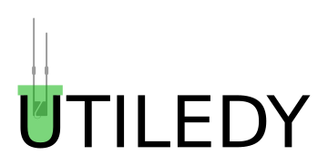

## Introduction

A general purpose class library for use with LEDs.
For now only normal, single color, LEDs are supported.
A future release will bring classes for RGB and RGBW LEDs.

I would like to call this library lightweight, but I have no clue if that's the case. 
I think it's not.

Still... it offers a lot of functionality with only a small amount of code needed in a sketch, so why not give it a try?

## Background

In a lot of my projects LEDs are used. Not just for indicative purposes, but almost always decorative.
The main functionalities I needed are:

* Gamma Correction
* Fading (in and out, but also waving)
* Blinking
* Sparkling
* All of them combined
* Colors (Soon...)

Every project I had to copy/paste the same functionality and most of the times I saw some things that could be done better.
Then, when I changed something in the sketch, those changes should also make their way to newer and older projects.
This made the choice for a LED library all the more appealing. It was also a good C++ exercise to do so. 

So I started writing a simple Arduino library, containing one class that had all the functionality I wanted.
In the end it was a cluttered LED class that could sparkle, blink, fade and act as a constant lightsource.
This was not a good way to do that, since there was no way to just create a blinker, without having the sparkle functionality.

That's why I started over. This time with a more hierarchical/layered approach.
Starting with a GammaLED class, that just has the gamma correction and the basic functionalities such as:

* Setting brightness, increasing, decreasing, correcting and mapping.
* Writing the corrected values to the outputs
* Smoothing the actual output (low pass filter)
* ...

Then I made a fader class that inherits from the LED class, but adds fading functionality.
After that, it was time to make a blinker and a sparkler class, which both act as the name suggest.
And finally a class that inherits from both the blinker and the sparkler and can act as both.

## Applications

Currently, the library is only tested for the ESP8266 using the Arduino IDE, but Arduino board support shall be added soon. 
